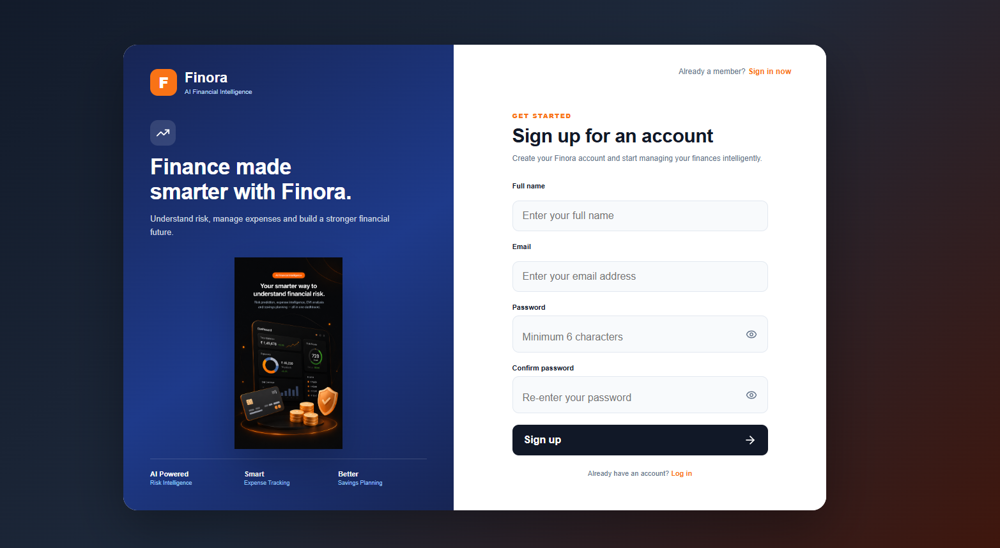
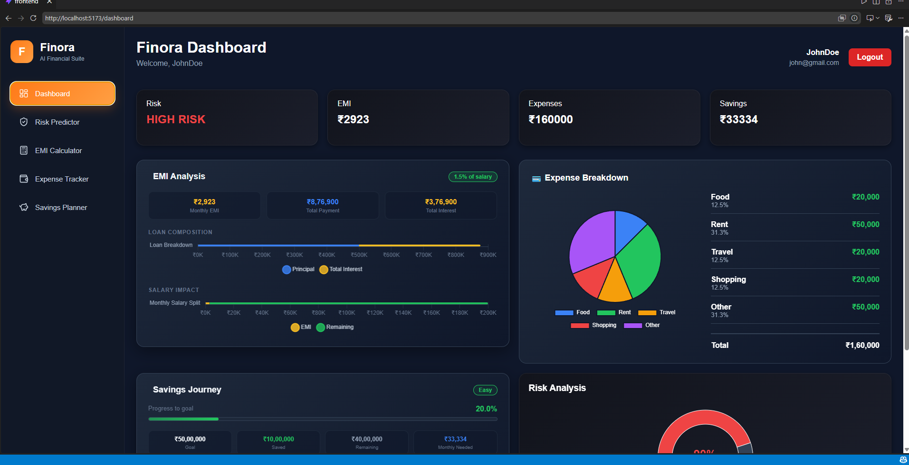

# 💰 Finora – AI Financial Risk & Credit Intelligence Platform

Finora is a full-stack AI-powered financial platform that helps users assess loan risk, calculate EMIs, track expenses, and plan savings through an intuitive dashboard. It combines Machine Learning with modern web technologies to provide intelligent financial insights.

---

## 🚀 Features

- 🔐 Secure User Authentication (JWT)
- 🤖 AI-based Credit Risk Prediction
- 💳 EMI Calculator
- 💸 Expense Tracker
- 🎯 Savings Planner
- 📊 Interactive Financial Dashboard
- 📈 Real-time Charts & Analytics
- 📱 Responsive Modern UI

---

## 🖥️ Tech Stack

### Frontend
- React.js
- React Router
- Axios
- Recharts
- Tailwind CSS / CSS3
- Lucide React Icons

### Backend
- Node.js
- Express.js
- JWT Authentication
- REST APIs

### Machine Learning
- Python
- Scikit-learn
- Random Forest Classifier
- NumPy
- Pandas

---

## 📂 Project Structure

```
Finora/
│
├── frontend/
│   ├── src/
│   │   ├── pages/
│   │   ├── components/
│   │   ├── assets/
│   │   ├── services/
│   │   └── App.jsx
│
├── backend/
│   ├── routes/
│   ├── middleware/
│   ├── models/
│   ├── server.js
│   └── package.json
│
├── ml-model/
│   ├── train_model.py
│   ├── predict.py
│   └── loan_model.pkl
│
└── README.md
```

---

## ✨ Modules

### 🔐 Authentication
- User Registration
- Secure Login
- JWT Authentication
- Protected Routes

### 🤖 AI Risk Prediction
Predicts loan approval risk using a Random Forest Machine Learning model and categorizes applications into:
- 🟢 Low Risk
- 🟡 Medium Risk
- 🔴 High Risk

### 💳 EMI Calculator
- Monthly EMI Calculation
- Interest Analysis
- Payment Breakdown

### 💸 Expense Tracker
- Add & Manage Expenses
- Category-wise Tracking
- Expense Distribution Charts

### 🎯 Savings Planner
- Set Savings Goals
- Monitor Progress
- Visual Savings Analytics

### 📊 Dashboard
- Financial Summary Cards
- Risk Analysis
- EMI Insights
- Expense Analytics
- Savings Progress

---

## 📸 Screenshots

### Login


### Signup



### Dashboard



---

## ⚙️ Installation

### Clone Repository

```bash
git clone https://github.com/yourusername/Finora.git
```

### Frontend

```bash
cd frontend
npm install
npm run dev
```

### Backend

```bash
cd backend
npm install
npm start
```

### Machine Learning

```bash
cd ml-model
python train_model.py
```

---

## 📈 Future Improvements

- Email Verification
- Credit Score Monitoring
- Investment Portfolio Tracker
- AI Financial Assistant
- Budget Recommendations
- PDF Report Generation
- Loan Comparison Engine

---

## 🎯 Learning Outcomes

- Full Stack Development
- REST API Design
- JWT Authentication
- React Component Architecture
- Machine Learning Integration
- Financial Data Visualization
- Responsive UI Development

---

## 👨‍💻 Author

**Anurag Agarwal**

GitHub: https://github.com/yourusername

LinkedIn: https://linkedin.com/in/yourprofile

---

## ⭐ If you like this project

Give this repository a ⭐ on GitHub!